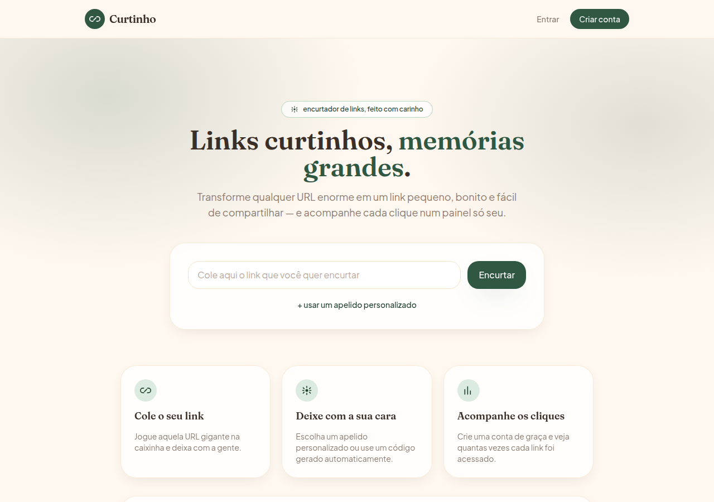
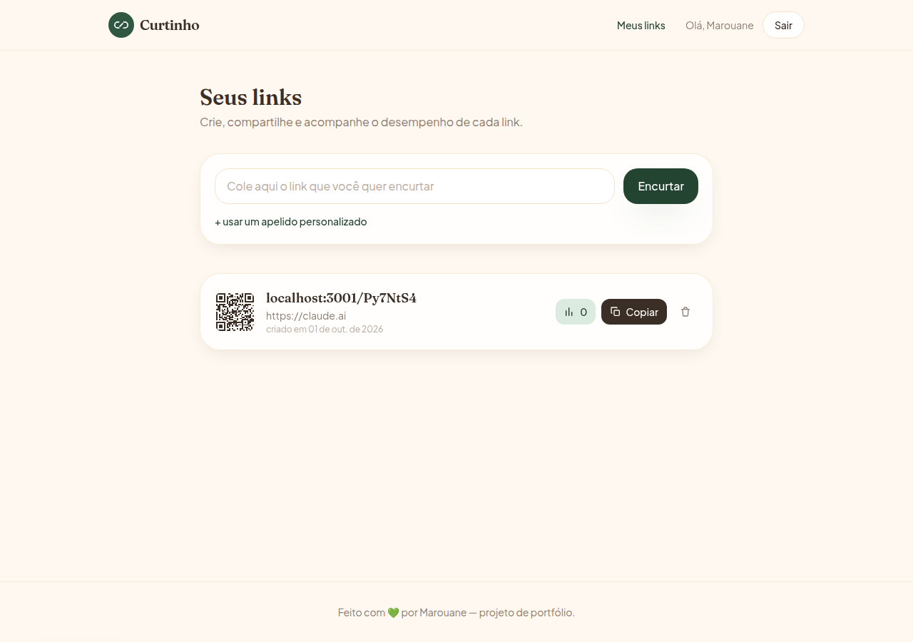

# Curtinho — encurtador de links

Um encurtador de URLs full-stack, construído como um pequeno sistema de
microsserviços: autenticação com JWT, geração de links curtos com alias
personalizado e expiração, contagem de cliques e um painel com estatísticas —
tudo atrás de um frontend em Next.js com visual próprio.



## O que o projeto faz

- Encurta qualquer URL, com ou sem login (anônimo ou associado à conta).
- Permite escolher um apelido personalizado para o link (`/meu-link`) ou gera
  um código aleatório.
- Define data de expiração opcional para um link.
- Redireciona (`GET /:slug`) e registra cada clique (data, referrer, user-agent).
- Painel do usuário com a lista de links, cliques totais, gráfico dos últimos
  7 dias e os acessos mais recentes.
- Gera um QR code do link encurtado na hora.



## Arquitetura

O backend é dividido em dois serviços NestJS independentes, cada um com seu
próprio schema Prisma e migrations, compartilhando a mesma instância do
Postgres (schemas separados: `auth` e `url_shortener`):

```
apps/
├── auth/           # NestJS — cadastro, login, emissão/validação de JWT
├── url-shortener/  # NestJS — criação, redirecionamento e estatísticas de links
└── web/            # Next.js — frontend que consome os dois serviços
gateway/            # KrakenD — reservado para um API Gateway futuro (não ativo ainda)
docker-compose.yml  # sobe Postgres + os três serviços juntos
```

O frontend fala diretamente com cada serviço via `fetch` no navegador
(`NEXT_PUBLIC_AUTH_API_URL` / `NEXT_PUBLIC_URL_SHORTENER_API_URL`); o `auth`
assina o JWT e o `url-shortener` o valida com o mesmo segredo, sem precisar
de uma chamada entre os dois serviços.

## Stack

**Backend**
- [NestJS](https://nestjs.com/) + TypeScript
- [Prisma ORM](https://www.prisma.io/) + PostgreSQL
- Autenticação com JWT (`@nestjs/jwt`, `passport-jwt`) e senhas com `bcrypt`
- Validação de entrada com `class-validator`

**Frontend**
- [Next.js 14](https://nextjs.org/) (App Router) + TypeScript
- [Tailwind CSS](https://tailwindcss.com/) com paleta e tipografia (Fraunces + Plus Jakarta Sans) personalizadas
- Geração de QR code no client (`qrcode`)

**Infra**
- Docker + docker-compose (Postgres, `auth`, `url-shortener` e `web` juntos)
- Cada serviço com testes unitários (Jest) e lint (ESLint/Prettier)

## Rodando localmente

Com Docker (sobe banco + os três serviços de uma vez):

```bash
cp .env.example .env
docker-compose up
```

- Frontend: http://localhost:3002
- API de autenticação: http://localhost:3000
- API de encurtamento: http://localhost:3001

Sem Docker, cada app em `apps/*` roda com `npm install && npm run start:dev`
(ou `npm run dev` no `web`), apontando `DATABASE_URL` para um Postgres local
e rodando `npx prisma migrate deploy` em `auth` e `url-shortener` antes de
subir.

## Principais endpoints da API

| Serviço | Endpoint | Descrição |
|---|---|---|
| `auth` | `POST /auth/register` | Cria uma conta |
| `auth` | `POST /auth/login` | Autentica e retorna um JWT |
| `auth` | `GET /auth/me` | Dados do usuário autenticado |
| `url-shortener` | `POST /api/urls` | Encurta uma URL (login opcional) |
| `url-shortener` | `GET /api/urls` | Lista os links do usuário logado |
| `url-shortener` | `GET /api/urls/:id/stats` | Estatísticas de um link (dono apenas) |
| `url-shortener` | `DELETE /api/urls/:id` | Remove um link (dono apenas) |
| `url-shortener` | `GET /:slug` | Redireciona e registra o clique |

## Próximos passos

- Deploy público (Vercel para o frontend, Railway/Render para os serviços e o banco).
- Ativar o API Gateway (KrakenD) em `gateway/`, hoje apenas reservado no `docker-compose.yml`.

---

Projeto de portfólio feito por Marouane.
